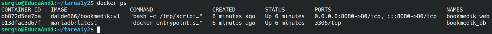
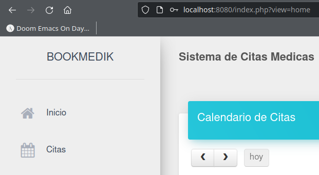

# Tarea final Docker
***Sergio***

> Documento redactado usando **Markdown**.

## Tarea 1 y 2

### Script

~~~ shell

#!/bin/bash
# Volcar la base de datos. El parámetro --password para que no pida la contraseña
sleep 5 && mariadb -u $BOOKMEDIK_USER --password=$BOOKMEDIK_PASSWORD -h \
$HOSTNAME $DB_NAME < /var/www/html/schema.sql
# Es igual a:
# mariadb -u bookmedik --password=bookmedik -h db
# Ejecutar Apache de fondo
apache2ctl -D FOREGROUND

~~~

### Dockerfile

Después de escribir el *Dockerfile* hay que construir la imagen con `docker build`.

~~~ dockerfile
# Dockerfile que permite desplegar una aplicación web escrita en PHP.
# El código fuente de la aplicación web está alojado en GitHub.

FROM debian:latest
# Actualizar paquetes
RUN apt update && apt upgrade -y \
# Instalar dependencias
&& apt install apache2 libapache2-mod-php php php-mysql mariadb-client -y \
# Limpiar caché
&& apt clean && rm -rf /var/lib/apt/lists/*
# Copiar la aplicación a la ruta de Apache
COPY bookmedik /var/www/html/
# Copiar el script
COPY script.sh /tmp/
# Darle permisos de ejecución y eliminar el index por defecto de Apache
RUN chmod +x /tmp/script.sh && rm /var/www/html/index.html
# Ejecutar el script
CMD ["bash", "-c", "/tmp/script.sh"]
~~~

### Docker Compose

~~~ yml
version: "3.9"
services:
  bookmedik:
    container_name: bookmedik_web
    image: dalde666/bookmedik:v1
    environment:
      BOOKMEDIK_USER: bookmedik
      BOOKMEDIK_PASSWORD: bookmedik
      HOSTNAME: db
      DB_NAME: bookmedik
    ports:
      - 8080:80
    depends_on:
      - db
  db:
    container_name: bookmedik_db
    image: mariadb:latest
    environment:
      MARIADB_ROOT_PASSWORD: root
      MARIADB_DATABASE: bookmedik
      MARIADB_USER: bookmedik
      MARIADB_PASSWORD: bookmedik
    volumes:
      - db_data:/var/lib/mysql
volumes:
    db_data:

~~~

### Fichero PHP

Modificaciones al fichero `bookmedik/core/controller/Database.php` para que coja las variables definidas en el Docker Compose.

~~~ php
function Database(){
		$this->user=getenv('BOOKMEDIK_USER');
		$this->pass=getenv('BOOKMEDIK_PASSWORD');
		$this->host=getenv('HOSTNAME');
		$this->ddbb=getenv('DB_NAME');
	}
~~~

### Contenedores ejecutándose

### Logeo satisfactorio

