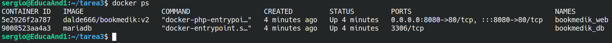
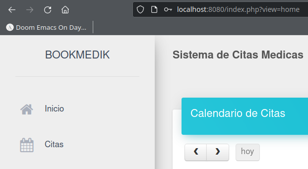

# Tarea final Docker

***Sergio***

> Documento redactado usando **Markdown**.

## Tarea 3

### Dockerfile

Es similar al de la tarea anterior solo que cambiamos la imagen de la que partimos y no instalamos apache porque la imagen ya lo incluye.

~~~ dockerfile
# Bookmedik no funciona con PHP superior a 7.4.
# Escogemos una imagen de PHP con apache incorporado.
FROM php:7.4-apache
# Instalar actualizaciones
RUN apt update && apt upgrade -y \
# Instalar dependencias
&& docker-php-ext-install mysqli pdo pdo_mysql \
&& apt install mariadb-client -y \
# Limpiar caché
&& apt clean && rm -rf /var/lib/apt/lists/*
# Copiar la aplicación en la ruta de Apache
COPY bookmedik /var/www/html/
# Copiar el script en el contenedor
COPY script.sh /tmp/
# Darle permisos de ejecución
RUN chmod +x /tmp/script.sh
# Ejecutar el script
CMD ["bash", "-c", "/tmp/script.sh"]
~~~

### Docker Compose

~~~ yml
version: "3.9"
services:
  bookmedik:
    container_name: bookmedik_web
    image: dalde666/bookmedik:v2
    environment:
      BOOKMEDIK_USER: bookmedik
      BOOKMEDIK_PASSWORD: bookmedik
      HOSTNAME: db
      DB_NAME: bookmedik
    ports:
      - 8080:80
    depends_on:
      - db
  db:
    container_name: bookmedik_db
    image: mariadb
    environment:
      MARIADB_ROOT_PASSWORD: root
      MARIADB_DATABASE: bookmedik
      MARIADB_USER: bookmedik
      MARIADB_PASSWORD: bookmedik
    volumes:
      - db_data:/var/lib/mysql
volumes:
    db_data:
~~~

### Script

~~~ shell
#!/bin/bash
# Volcar esquema a MariaDB
sleep 5 && mariadb -u $BOOKMEDIK_USER --password=$BOOKMEDIK_PASSWORD \
-h $HOSTNAME $DB_NAME < /var/www/html/schema.sql
# Ejecutar Apache de fondo (como demonio)
apache2ctl -D FOREGROUND
~~~

### docker ps
Comprobar los contenedores corriendo.

### Comprobación

Comprobamos que funciona tras logearnos.

