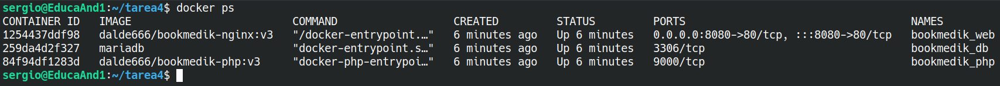

# Tarea final Docker

***Sergio***

> Documento redactado usando **Markdown**.

## Tarea 4

### Dockerfile PHP

Vamos a construir una imagen de PHP-FPM con dependencias para PDO.

~~~ dockerfile
FROM php:7.4-fpm
RUN docker-php-ext-install mysqli pdo pdo_mysql
~~~

### Dockerfile NGINX

Vamos a construir una imagen para trabajar con el servidor web *NGINX*.
Lo único que cambia respecto a trabajar con Apache es incluir el fichero `default.conf` en el directorio `/etc/nginx/conf.d/` para cargar una configuración personalizada.

~~~ dockerfile
# Configurar servidor nginx
FROM nginx:latest
# Instalar actualizaciones
RUN apt update && apt upgrade -y \
# Instalar dependencias
&& apt install mariadb-client -y \
# Limpiar caché
&& apt clean && rm -rf /var/lib/apt/lists/*
# Copiar el fichero del configuración de nginx
COPY default.conf /etc/nginx/conf.d/
# Copiar la aplicación en la ruta de nginx
COPY bookmedik /usr/share/nginx/html
# Copiar el script
COPY script.sh /tmp/
# Doy permisos de ejecución y elimino el fichero por defecto
RUN chmod +x /tmp/script.sh && rm /usr/share/nginx/html/index.html
# Lanzo el script
CMD ["bash", "-c", "/tmp/script.sh"]
~~~

### default.conf

Fichero de configuración de Nginx.

~~~ conf
server {
    listen       80;
    listen  [::]:80;
    server_name  localhost;
    error_log  /var/log/nginx/error.log;
    access_log /var/log/nginx/access.log;
    root   /usr/share/nginx/html;
    index  index.php index.html;
    location ~ \.php$ {
        try_files $uri =404;
        fastcgi_split_path_info ^(.+\.php)(/.+)$;
        # Debe coincidir con el nombre del contenedor especificado en el Docker Compose que contenga PHP-FPM
        fastcgi_pass bookmedik_php:9000;
        fastcgi_index index.php;
        include fastcgi_params;
        fastcgi_param SCRIPT_FILENAME $document_root$fastcgi_script_name;
        fastcgi_param PATH_INFO $fastcgi_path_info;
    }
}

~~~

### Docker Compose

~~~ yml
version: "3.9"
services:

  bookmedik:
    container_name: bookmedik_web
    image: dalde666/bookmedik-nginx:v3
    environment:
      BOOKMEDIK_USER: bookmedik
      BOOKMEDIK_PASSWORD: bookmedik
      HOSTNAME: db
      DB_NAME: bookmedik
    ports:
      - 8080:80
    depends_on:
      - db
      - php
    volumes:
      - phpdocs:/usr/share/nginx/html/

  db:
    container_name: bookmedik_db
    image: mariadb
    environment:
      MARIADB_ROOT_PASSWORD: root
      MARIADB_DATABASE: bookmedik
      MARIADB_USER: bookmedik
      MARIADB_PASSWORD: bookmedik
    volumes:
      - db_data:/var/lib/mysql

  php:
    container_name: bookmedik_php
    image: dalde666/bookmedik-php:v3
    environment:
      BOOKMEDIK_USER: bookmedik
      BOOKMEDIK_PASSWORD: bookmedik
      HOSTNAME: db
      DB_NAME: bookmedik
    volumes:
      - phpdocs:/usr/share/nginx/html/

volumes:
    db_data:
    phpdocs:

~~~

### Script

~~~ shell
#!/bin/bash

# Darle tiempo al resto de contenedores a arrancar
sleep 8 && mariadb -u $BOOKMEDIK_USER --password=$BOOKMEDIK_PASSWORD \
-h $HOSTNAME $DB_NAME < /usr/share/nginx/html/schema.sql

nginx -g "daemon off;"
~~~

### docker ps
Comprobar los contenedores corriendo.

### Comprobación

Comprobamos que funciona tras logearnos.

